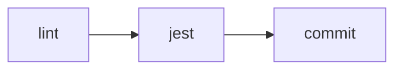
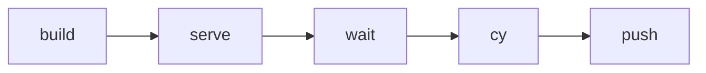
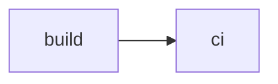
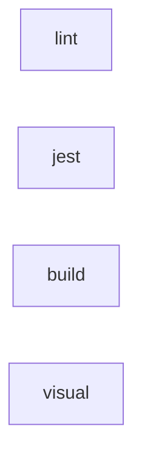
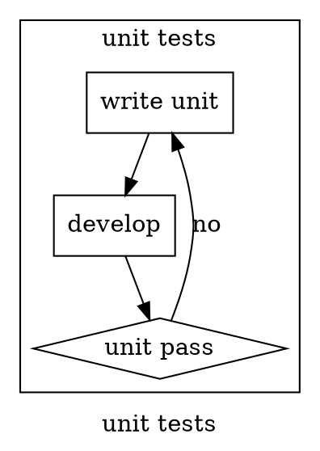
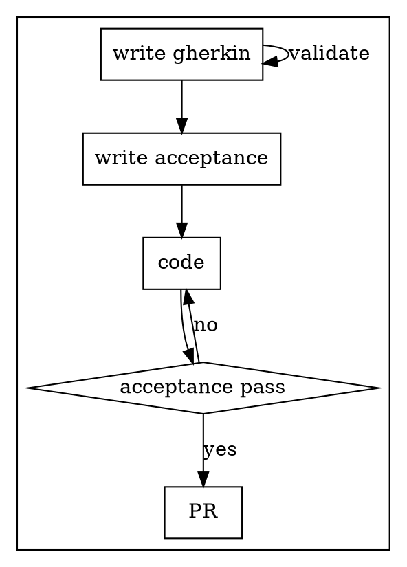
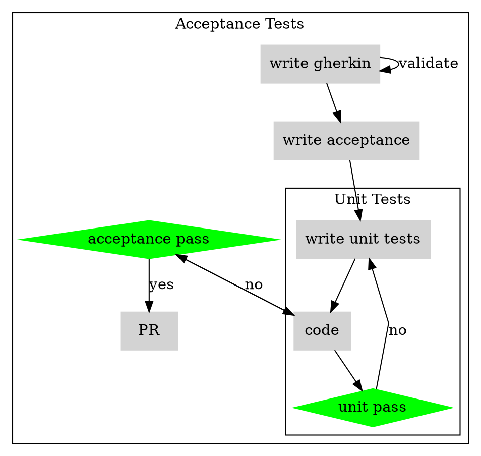
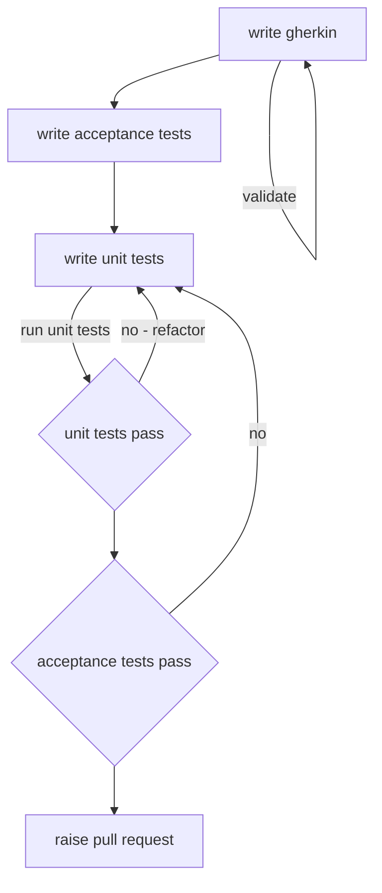
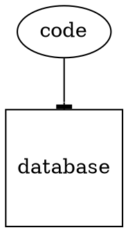

# BDD TDD Workshop

## Install

`yarn install`

## Run Application

`yarn start`

## Testing

### Unit Tests

`yarn jest` // runs tests in watch mode

### Cypress

`yarn cy:ide`

* Headless

`yarn cy:ci`

* Smoke only

`yarn cy:ci:smoke`

Run subset of tests using [Cucumber tag expressions](https://github.com/cucumber/cucumber/tree/master/tag-expressions)

## Storybook

`yarn start-storybook`

## Stack

React Bootstrap https://react-bootstrap.github.io

Gherkin https://docs.cucumber.io/gherkin/reference/

Cypress https://docs.cypress.io/examples/examples/recipes.html#Node-Modules

## Applitools

https://github.com/applitools/eyes-cypress

eyes check window
Arguments to cy.eyesCheckWindow

tag (optional): A logical name for this check.

sizeMode (optional): Possible values are:

full-page: This is the default value. It means a screenshot of everything that exists in the DOM at the point of calling eyesCheckWindow will be rendered.
viewport: Only a screenshot the size of the browser will be rendered (the size of the browser can be set in the call to cy.eyesOpen - see Advanced configuration below).
selector: Take a screenshot of the content of the element targeted by css or xpath selector. It's necessary to specify the value of the selector in the selector argument.
region: Take a screenshot of a region of the page, specified by coordinates. It's necessary to specify the value of the region in the region argument.

StoryBook support
https://applitools.com/tutorials/storybook-react.html#customizations

### Static

Lint

Types

### Precommit

### Prepush

### Now Build

### CI

### Unit Testing

### Acceptance Testing

### Combined Unit and Acceptance TDD

### Test Method

###  Slack Integration

